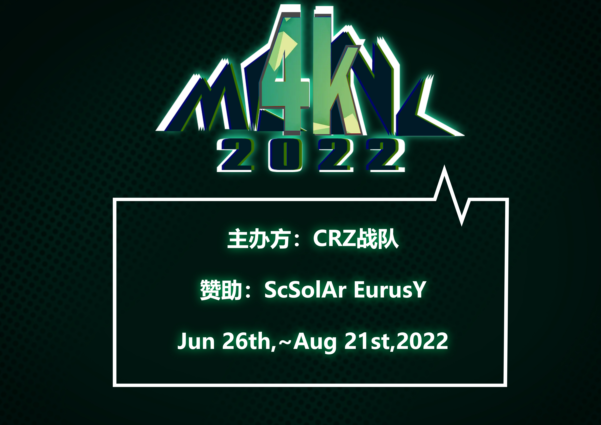

---
tags:
  - MCNC
  - MCNC2022
  - MCNC 2022
---

# osu!mania 4K Chinese National Cup 2022

The **osu!mania 4K Chinese National Cup 2022** (***MCNC 2022***) was a country-based osu!mania tournament hosted by the \[Crz\]Team. It was the forth instalment of the osu!mania 4K Chinese National Cup.

## Tournament schedule

| Event | Timestamp |
| --: | :-- |
| Registration phase | 2022-5-15/2022-6-12 |
| Qualifier Mappool Showcase | 2022-6-26 |
| Qualifiers | 2022-7-1/2022-7-3 |
| Round of 64 | 2022-7-9/2022-7-10 |
| Round of 32 | 2022-7-16/2022-7-17 |
| Round of 16 | 2022-7-23/2022-7-24 |
| Quarterfinals | 2022-7-30/2022-7-31 |
| Semifinals | 2022-8-6/2022-8-7 |
| Finals | 2022-8-13/2022-8-14 |
| Grand Finals | 2022-8-20/2022-8-21 |

| Placing | Prizes |
| :-: | :-- |
|  | CNY 2,888, unique profile badge, MCNC custom clothing |
|  | CNY 1,888, MCNC custom clothing |
|  | CNY 888, MCNC custom clothing |
| 4th to 8th | 2 months of osu!supporter |
| 9th to 32nd | 1 month of osu!supporter |
| Players eliminated in qualifiers | CNY 20 |

## Organisation

The osu!mania 4K Chinese National Cup 2022 was run by various community members.

| Position | Member(s) |
| :-- | :-- |
| Organisers | ::{ flag=CN }:: [\[Crz\]xz1z1z](https://osu.ppy.sh/users/10500832) (Host) |
| Referees | ::{ flag=CN }:: [\[Crz\]xz1z1z](https://osu.ppy.sh/users/10500832), ::{ flag=CN }:: [\[GB\]Sanae](https://osu.ppy.sh/users/11238501), ::{ flag=CN }:: [\[Crz\]Caicium](https://osu.ppy.sh/users/10702235), ::{ flag=CN }:: [Muziyami](https://osu.ppy.sh/users/7003013), ::{ flag=CN }:: [Sonoaoi](https://osu.ppy.sh/users/9755808), ::{ flag=CN }:: [\[Crz\]Makii](https://osu.ppy.sh/users/5242158), ::{ flag=CN }:: [FcEazy](https://osu.ppy.sh/users/7825227), ::{ flag=CN }:: [Rasis](https://osu.ppy.sh/users/1209363) |
| Mappoolers | ::{ flag=CN }:: [\[Crz\]xz1z1z](https://osu.ppy.sh/users/10500832), ::{ flag=CN }:: [\[Crz\]Satori](https://osu.ppy.sh/users/7082178), ::{ flag=CN }:: [YuEast 2018](https://osu.ppy.sh/users/13953619), ::{ flag=CN }:: [\[GB\]Sanae](https://osu.ppy.sh/users/11238501), ::{ flag=CN }:: [aa219040](https://osu.ppy.sh/users/11653961), ::{ flag=CN }:: [\_Stan](https://osu.ppy.sh/users/1653229), ::{ flag=ID }:: [eZmmR](https://osu.ppy.sh/users/8647138) |
| Mappool testers | ::{ flag=TH }:: [MIkuaimbot](https://osu.ppy.sh/users/17699745) ::{ flag=CN }:: [\[Crz\]Caicium](https://osu.ppy.sh/users/10702235) ::{ flag=AU }:: [\[Crz\]Lochie](https://osu.ppy.sh/users/9527845), ::{ flag=MY }:: [Onlinee](https://osu.ppy.sh/users/13630137), ::{ flag=HK }:: [osu_degenstage5](https://osu.ppy.sh/users/11563203) |
| Guest Mappers | ::{ flag=CN }:: [\[Crz\]xz1z1z](https://osu.ppy.sh/users/10500832), ::{ flag=CN }:: [YuEast 2018](https://osu.ppy.sh/users/13953619), ::{ flag=CN }:: [\[GB\]Sanae](https://osu.ppy.sh/users/11238501), ::{ flag=CN }:: [\[Crz\]Satori](https://osu.ppy.sh/users/7082178), ::{ flag=SG }:: [Evening](https://osu.ppy.sh/users/2193881), ::{ flag=SG }:: [Raveille](https://osu.ppy.sh/users/1388767), ::{ flag=ID }:: [eZmmR](https://osu.ppy.sh/users/8647138), ::{ flag=ID }:: [\[Crz\]Crysarlene](https://osu.ppy.sh/users/5492871), ::{ flag=CN }:: [Muses](https://osu.ppy.sh/users/9705896), ::{ flag=CN }:: [\[Crz\]Alleyne](https://osu.ppy.sh/users/11279273) |
| Streamers | ::{ flag=CN }:: [\[Crz\]xz1z1z](https://osu.ppy.sh/users/10500832), ::{ flag=CN }:: [110](https://osu.ppy.sh/users/4524921) ::{ flag=CN }:: [Muziyami](https://osu.ppy.sh/users/7003013), ::{ flag=CN }:: [Sonoaoi](https://osu.ppy.sh/users/9755808), ::{ flag=CN }:: [FcEazy](https://osu.ppy.sh/users/7825227), ::{ flag=CN }:: [\[Crz\]Makii](https://osu.ppy.sh/users/5242158), ::{ flag=CN }:: [Rasis](https://osu.ppy.sh/users/1209363) |
| Commentators | TBA |
| Graphics Design | ::{ flag=CN }:: [Dr_Tissues](https://osu.ppy.sh/users/5106681) |

## Links

- [Discussion thread (English)](https://osu.ppy.sh/community/forums/topics/1567764)
- [Discussion thread (Chinese)](https://osu.ppy.sh/community/forums/topics/1567763)
- [Livestream](https://live.bilibili.com/2996250)
- [Discord Server](https://discord.gg/uBHK5vq)
- [Challonge bracket](https://challonge.com/zh_CN/MCNC2022)
- **[Statistics sheet]()**

## Participants

| Seed | Player |
| :-: | :-- |
| #1 | ::{ flag=HK }:: [MegMewtwoZ](https://osu.ppy.sh/users/13235067) |
| #2 | ::{ flag=HK }:: [Quotient GD](https://osu.ppy.sh/users/11313227) |
| #3 | ::{ flag=HK }:: [Ricizus](https://osu.ppy.sh/users/10395139) |
| #4 | ::{ flag=CN }:: [[GB]Mafufu](https://osu.ppy.sh/users/10884561) |
| #5 | ::{ flag=CN }:: [Akermo](https://osu.ppy.sh/users/14934242) |
| #6 | ::{ flag=CN }:: [Kuiiiiteeee](https://osu.ppy.sh/users/7304075) |
| #7 | ::{ flag=CN }:: [\[Crz\]Reimu](https://osu.ppy.sh/users/14318312) |
| #8 | ::{ flag=CN }:: [\[Crz\]rebellion](https://osu.ppy.sh/users/15625432) |
| #9 | ::{ flag=CN }:: [\[GB\]AelSan](https://osu.ppy.sh/users/14095291) |
| #10 | ::{ flag=CN }:: [\[Crz\]sunnyxxy](https://osu.ppy.sh/users/10333739) |
| #11 | ::{ flag=CN }:: [\[Crz\]Riko](https://osu.ppy.sh/users/7928981) |
| #12 | ::{ flag=CN }:: [alivn](https://osu.ppy.sh/users/15807665) |
| #13 | ::{ flag=CN }:: [tyrcs](https://osu.ppy.sh/users/13026904) |
| #14 | ::{ flag=HK }:: [Yana Feiya](https://osu.ppy.sh/users/7802517) |
| #15 | ::{ flag=CN }:: [\[GB\]Luoxuan0327](https://osu.ppy.sh/users/8586018) |
| #16 | ::{ flag=CN }:: [\[GB\]gluefly](https://osu.ppy.sh/users/8715409) |
| #17 | ::{ flag=CN }:: [YuLiangSSS](https://osu.ppy.sh/users/15889644) |
| #18 | ::{ flag=CN }:: [LFWY](https://osu.ppy.sh/users/8611484) |
| #19 | ::{ flag=CN }:: [Miyes](https://osu.ppy.sh/users/12942073) |
| #20 | ::{ flag=CN }:: [- Minato Aqua -](https://osu.ppy.sh/users/14767969) |
| #21 | ::{ flag=TW }:: [murorachi](https://osu.ppy.sh/users/8682905) |
| #22 | ::{ flag=CN }:: [-Chen-](https://osu.ppy.sh/users/14030362) |
| #23 | ::{ flag=CN }:: [zzzzzzsa6177](https://osu.ppy.sh/users/10443855) |
| #24 | ::{ flag=CN }:: [Rizazyh](https://osu.ppy.sh/users/13673300) |
| #25 | ::{ flag=CN }:: [- Xiaoluoli -](https://osu.ppy.sh/users/9502281) |
| #26 | ::{ flag=CN }:: [\[GB\]Tyris](https://osu.ppy.sh/users/10497659) |
| #27 | ::{ flag=CN }:: [Krn_](https://osu.ppy.sh/users/12452291) |
| #28 | ::{ flag=CN }:: [Zyuuu](https://osu.ppy.sh/users/15389275) |
| #29 | ::{ flag=CN }:: [chana](https://osu.ppy.sh/users/18375016) |
| #30 | ::{ flag=CN }:: [IsxI](https://osu.ppy.sh/users/18042127) |
| #31 | ::{ flag=CN }:: [Wings_AnChen](https://osu.ppy.sh/users/12694894) |
| #32 | ::{ flag=CN }:: [\[GB\]yobrevelc](https://osu.ppy.sh/users/14128407) |
| #33 | ::{ flag=CN }:: [\[GB\]sherweifa](https://osu.ppy.sh/users/17457562) |
| #34 | ::{ flag=CN }:: [gzdongsheng](https://osu.ppy.sh/users/8660315) |
| #35 | ::{ flag=CN }:: [CLLbin](https://osu.ppy.sh/users/11837219) |
| #36 | ::{ flag=CN }:: [MkoTenshi](https://osu.ppy.sh/users/6532520) |
| #37 | ::{ flag=CN }:: [YUCInoback](https://osu.ppy.sh/users/24449770) |
| #38 | ::{ flag=CN }:: [shizehao](https://osu.ppy.sh/users/4928674) |
| #39 | ::{ flag=CN }:: [Molli](https://osu.ppy.sh/users/8893772) |
| #40 | ::{ flag=CN }:: [DJ Sharpnel](https://osu.ppy.sh/users/5132402) |
| #41 | ::{ flag=CN }:: [U1d](https://osu.ppy.sh/users/10125072) |
| #42 | ::{ flag=CN }:: [Rudown](https://osu.ppy.sh/users/7850540) |
| #43 | ::{ flag=HK }:: [Alptraum](https://osu.ppy.sh/users/26496648) |
| #44 | ::{ flag=CN }:: [\[JbL\]Hx_032](https://osu.ppy.sh/users/11603156) |
| #45 | ::{ flag=CN }:: [shade0214](https://osu.ppy.sh/users/14665128) |
| #46 | ::{ flag=CN }:: [N3k0ha_5h12uku](https://osu.ppy.sh/users/8781662) |
| #47 | ::{ flag=CN }:: [Etanity Larva](https://osu.ppy.sh/users/10449022) |
| #48 | ::{ flag=CN }:: [katiexie](https://osu.ppy.sh/users/5908765) |
| #49 | ::{ flag=HK }:: [MCPXiaoBai](https://osu.ppy.sh/users/11259611) |
| #50 | ::{ flag=CN }:: [Sakurada Shiro](https://osu.ppy.sh/users/14617751) |
| #51 | ::{ flag=CN }:: [2580697339](https://osu.ppy.sh/users/6311072) |
| #52 | ::{ flag=CN }:: [Gregcraft](https://osu.ppy.sh/users/18809246) |
| #53 | ::{ flag=CN }:: [\[GB\]Cz](https://osu.ppy.sh/users/9191281) |
| #54 | ::{ flag=CN }:: [ICspoon](https://osu.ppy.sh/users/10398689) |
| #55 | ::{ flag=XX }:: [MIKUlove_](https://osu.ppy.sh/users/20387245) |
| #56 | ::{ flag=CN }:: [dreamed123](https://osu.ppy.sh/users/20602698) |
| #57 | ::{ flag=CN }:: [\[GB\]dotdot](https://osu.ppy.sh/users/15923740) |
| #58 | ::{ flag=HK }:: [iRedi](https://osu.ppy.sh/users/8005579) |
| #59 | ::{ flag=CN }:: [Hunxin](https://osu.ppy.sh/users/6397367) |
| #60 | ::{ flag=CN }:: [YuanLiang](https://osu.ppy.sh/users/21013668) |
| #61 | ::{ flag=CN }:: [luluxia](https://osu.ppy.sh/users/5863409) |
| #62 | ::{ flag=CN }:: [zerda](https://osu.ppy.sh/users/20421597) |
| #63 | ::{ flag=HK }:: [Mayano Top Gun](https://osu.ppy.sh/users/11970894) |
| - | ::{ flag=HK }:: [BongoCat_-](https://osu.ppy.sh/users/17348593) |
| - | ::{ flag=CN }:: [Jueziii](https://osu.ppy.sh/users/14726786) |
| - | ::{ flag=CN }:: [\[Crz\]xz1z1z](https://osu.ppy.sh/users/10500832) |
| - | ::{ flag=HK }:: [osu_degenstage5](https://osu.ppy.sh/users/11563203) |
| - | ::{ flag=CN }:: [PIKAQIUQIU](https://osu.ppy.sh/users/13542602) |
| - | ::{ flag=CN }:: [3504622685](https://osu.ppy.sh/users/15993106) |
| - | ::{ flag=CN }:: [cowking123](https://osu.ppy.sh/users/24246011) |
| - | ::{ flag=CN }:: [\[Paw\]FIood](https://osu.ppy.sh/users/6336721) |
| - | ::{ flag=CN }:: [lany520_zk](https://osu.ppy.sh/users/25293180) |
| - | ::{ flag=CN }:: [VoneRedC](https://osu.ppy.sh/users/27046926) |
| - | ::{ flag=CN }:: [Shenyin](https://osu.ppy.sh/users/259834) |

## Podium

This competition has come to an end and resulted in the following podium:

| Placing | Player |
| :-: | :-- |
|  | ::{ flag=HK }:: [Quotient GD](https://osu.ppy.sh/users/11313227) |
|  | ::{ flag=CN }:: [\[Crz\]sunnyxxy](https://osu.ppy.sh/users/10333739) |
|  | ::{ flag=HK }:: [MegMewtwoZ](https://osu.ppy.sh/users/13235067) |

## Mappools

### Grand Finals

**[Download the mappack here! (291 MB)](https://drive.google.com/file/d/1fZqVc1PPkJvp4QUt2F3eMukLW9vgoDP1/view?usp=sharing)**

- FreeMod
  1. [Ariabl'eyes - Namidasou Outomata (Cut   Ver.) \[Rachel's Lv.30(Marathon) 1.05 (189bpm)\]](https://osu.ppy.sh/beatmapsets/1827294#mania/3750023)
  2. [Noisestorm - Antihero (Original Mix)   \[Ancient\]](https://osu.ppy.sh/beatmapsets/1813707#mania/3720773)
  3. [Falcom Sound Team jdk - Hard Desperation   \[Nightmare\]](https://osu.ppy.sh/beatmapsets/1613480#mania/3294142)
  4. [SHK- Super Fantasy \[Super Jacks 1.2x   (174bpm)\]](https://osu.ppy.sh/beatmapsets/1823684#mania/3742104)
  5. [lmperial Circus Dead Decadence -   BRING+EYES=DEATH+INVITE \[sleet\]](https://osu.ppy.sh/beatmapsets/762130#mania/1602426)
  6. [La priere - Kimiyo \[Eirini [16/cut\]]](https://osu.ppy.sh/beatmapsets/1710026#mania/3494228)
  7. [7_7 - Mousou Chikan Express \[Persecution   Complex [17\]]](https://osu.ppy.sh/beatmapsets/1756404#mania/3594321)
  8. [B-ko (Cv:Touyama Nao) - Nisemono Chuuihou   \[timing hell?\]](https://osu.ppy.sh/beatmapsets/1759390#mania/3600837)
  9. [katagiri - Sendan Life (katagiri Bootleg)   \[Raveille's NostaLNgia 1.1x (286bpm)\]](https://osu.ppy.sh/beatmapsets/1827506#mania/3750601)
  10. [After the Rain - Anti-Clockwise \[True   Ending\]](https://osu.ppy.sh/beatmapsets/1802781#mania/3696755)
  11. [Camellia - Enantiomorphs \[Diastereomers   [1.2x Rate\]]](https://osu.ppy.sh/beatmapsets/1742086#mania/3561401)
  12. [Camellia - +ERABY+E CONNEC+10N \[504   ServerError: Gateway Timeout\]](https://osu.ppy.sh/beatmapsets/1338625#mania/2772922)
  13. [Camellia - Dans la mer de son \[Diabolos   x1.1\]](https://osu.ppy.sh/beatmapsets/1443348#mania/2968916)
  14. [TryHardNinja - Revenge (feat.   CaptainSparklez) (ReeK's "Dude, What's A Genre?" Remix) \[mint's   Creeper 1.1x (181bpm)\]](https://osu.ppy.sh/beatmapsets/1827304#mania/3750051)
  15. [lmperial Circus Dead Decadence - Uta   \[Everlasting Duet 1.25x\]](https://osu.ppy.sh/beatmapsets/1825157#mania/3745609)
  16. [Alon Mor - Oselot \[Demons\]](https://osu.ppy.sh/beatmapsets/632073#mania/1341876)
  17. [sabi - true DJ MAG top ranker's song   Zenpen (katagiri Remix) \[fn(top=true,sv=true)\]](https://osu.ppy.sh/beatmapsets/1569250#mania/3204545)
- Tiebreaker
  1. [Tsukimi Shizuka x LUNARiUM - Fight Against   the Past \[Revolution\]](https://osu.ppy.sh/beatmapsets/1828541#mania/3752841)

### Finals

**[Download the mappack here! (160 MB)](https://drive.google.com/file/d/1vqW9RVc1kdPriSqt7pfHV8Ak0aZpMxzs/view?usp=sharing)**

- FreeMod
  1. [Bassnectar - Undercover \[Boombox\]](https://osu.ppy.sh/beatmapsets/1358701#mania/2811599)
  2. [Junk - Qualia \[XingRen's Hard (Edit) 1.1x\]](https://osu.ppy.sh/beatmapsets/1822087#mania/3738813)
  3. [Sora Tokino - Asu no Yozora Shoukaihan   \[STEPDWI's Challenge 1.4x\]](https://osu.ppy.sh/beatmapsets/1822379#mania/3739498)
  4. [Last Note. - Setsuna Trip \[Muses &   xz's Chordjack Trip\]](https://osu.ppy.sh/beatmapsets/1710023#mania/3494222)
  5. [Tatsh a.k.a. Zeami - Amaterasu \[Challenge   LessLN\]](https://osu.ppy.sh/beatmapsets/1536614#mania/3715906)
  6. [onoken - P8107 \[Inverse Reorganization\]](https://osu.ppy.sh/beatmapsets/1393987#mania/2877554)
  7. [onumi - PERSONALITY \[MIRAGE OD 8\]](https://osu.ppy.sh/beatmapsets/1234328#mania/3739939)
  8. [umu. - humanly \[timing hell?\]](https://osu.ppy.sh/beatmapsets/1184226#mania/2468707)
  9. [ikaruga_nex - gigadelic(m3rkAb4# R3m!x)   \[Incandescence 1.05x\]](https://osu.ppy.sh/beatmapsets/1822036#mania/3738622)
  10. [Sakuzyo - PANDORA PARADOXXX \[Epicurus   Wisdom\]](https://osu.ppy.sh/beatmapsets/1149516#mania/2399832)
  11. [Feryquitous - Dille \[() => { return H   }\]](https://osu.ppy.sh/beatmapsets/1270439#mania/2640148)
  12. [katagiri - Angel's Salad \[Challenge x1.05\]](https://osu.ppy.sh/beatmapsets/1757208#mania/3595932)
  13. [ZYTOKINE - Dancing Dollz feat. cold kiss -   REDALiCE Remix \[1.2x Edit\]](https://osu.ppy.sh/beatmapsets/1650227#mania/3485172)
  14. [Lime / Kankitsu - 8bit voyager \[Easy\]](https://osu.ppy.sh/beatmapsets/1393818#mania/2877235)
  15. [Getty vs. DJ DiA - Drop-Z-Line   \[Deteriorate\]](https://osu.ppy.sh/beatmapsets/1658896#mania/3386303)
  16. [edIT - Ants \[Stage 1: Sting\]](https://osu.ppy.sh/beatmapsets/901864#mania/1882999)
  17. [PSYQu - Decay \[Sandbag\]](https://osu.ppy.sh/beatmapsets/1617304#mania/3302183)
- TieBreaker
  1. [HyuN feat. Sennzai - Duplicity Shade   \[Muses vs xz's WTF!\]](https://osu.ppy.sh/beatmapsets/1823673#mania/3742074)

### Semifinals

**[Download the mappack here! (213 MB)](https://drive.google.com/file/d/10fLdTQVlexb5cFMB_Ghdcql3hlQ4Sueq/view?usp=sharing)**

- FreeMod
  1. [Memme - Bronze \[The Eye \[LN reduced\]\]](https://osu.ppy.sh/beatmapsets/1789771#mania/3726256)
  2. [L.E.D.- THE LAST STRIKER \[Annihilation   1.4x (259bpm)\]](https://osu.ppy.sh/beatmapsets/1489054#mania/3059477)
  3. [Sanxion7 - Gargoyle (2009 version)   \[1.6km (240bpm)\]](https://osu.ppy.sh/beatmapsets/1815862#mania/3725240)
  4. [Croire - GLORIA \[Repentance 1.15x   (Edit) (282bpm)\]](https://osu.ppy.sh/beatmapsets/1624275#mania/3714544)
  5. [M-O-T-U - Red Liquid \[Dysmenorrhea\]](https://osu.ppy.sh/beatmapsets/1730175#mania/3536001)
  6. [Haruko Momoi - Eiyuu no Uta \[STORM OF   BLOOD\]](https://osu.ppy.sh/beatmapsets/1483232#mania/3114832)
  7. [KAYZO/REAPER/Qoiet - Wait (feat. Qoiet)   \[Make'em wait MotherFxxker!!!\]](https://osu.ppy.sh/beatmapsets/1247638#mania/2593222)
  8. [Function Phantom - Integral Cube   \[Limit\]](https://osu.ppy.sh/beatmapsets/1698324#mania/3470046)
  9. [Suzaku vs Genbu - Himiko \[Agonize\]](https://osu.ppy.sh/beatmapsets/1472305#mania/3022237)
  10. [Moon Symphony - Regulus \[Godwink\]](https://osu.ppy.sh/beatmapsets/1592955#mania/3253451)
  11. [penoreri - BLACK SWAN \[Last Ballet\]](https://osu.ppy.sh/beatmapsets/1689947#mania/3453472)
  12. [xi - Angel's Ladder \[Ascension to   Heaven\]](https://osu.ppy.sh/beatmapsets/1742494#mania/3562153)
  13. [ZxNX - Schadenfreude \[Malicious\]](https://osu.ppy.sh/beatmapsets/1815968#mania/3725474)
  14. [Jay Chou - Greatest Works of Art.   \[Alleyne vs xz's Greatest Works of Map 1.1x\]](https://osu.ppy.sh/beatmapsets/1815937#mania/3725375)
  15. [Camellia feat. Nana Takahashi - Mushi   no Sumu Tokoro -Ugomeki wa nao fukamaru- \[Formication (cut)\]](https://osu.ppy.sh/beatmapsets/1800811#mania/3691933)
  16. [DJPoyoshi - Esperanza \[SVranza\]](https://osu.ppy.sh/beatmapsets/1232159#mania/3067776)
  17. [Eliminate - Weeble Wobble VIP   \[Helluvit\]](https://osu.ppy.sh/beatmapsets/1692600#mania/3458605)
- TieBreaker
  1. [Camellia - Qyoh (Nine Stars) \[to   Tesellate a Constellation\]](https://osu.ppy.sh/beatmapsets/1818720#mania/3731524)

### Quarterfinals

**[Download the mappack here! (172 MB)](https://drive.google.com/file/d/1gg_0C_IjJyQxn1vfaVn62pbJ2VcTICsb/view?usp=sharing)**

- FreeMod
  1. [E-Type - Russian Lullaby \[blin\]](https://osu.ppy.sh/beatmapsets/1538061#mania/3144687)
  2. [goreshit - thinking of you \[obsession   1.1x (250bpm)\]](https://osu.ppy.sh/beatmapsets/1395676#mania/3553232)
  3. [Last Note. - Trashy Innocence \[#1   Team's Challenge\]](https://osu.ppy.sh/beatmapsets/1710030#mania/3494237)
  4. [Hayasaka Ai (CV: Yumiri Hanamori) -   Kanashikute lulululu \[lulu 1.2x (138bpm)\]](https://osu.ppy.sh/beatmapsets/1811007#mania/3714570)
  5. [lgorrr - Tout Petit Moineau \[Wh1teh's   Sparrow (Edit)\]](https://osu.ppy.sh/beatmapsets/1810808#mania/3714160)
  6. [katagiri - Dogs \[Guau Guau\]](https://osu.ppy.sh/beatmapsets/1592967#mania/3253475)
  7. [Two Door Cinema Club - Undercover   Martyn \[until next day\]](https://osu.ppy.sh/beatmapsets/1771855#mania/3627514)
  8. [DJ TOTTO -DORNWALD ~Junge~ \[Anima 1.1x\]](https://osu.ppy.sh/beatmapsets/1660098#mania/3388945)
  9. [john - Shun-ran \[Harugakita [1.1x   Rate\]]](https://osu.ppy.sh/beatmapsets/1810856#mania/3714245)
  10. [Juggernaut. - Valkyrius:0 \[Impending\]](https://osu.ppy.sh/beatmapsets/1617951#mania/3303402)
  11. [YAHPP - Chimera \[Why dont u just get up   and dance man\]](https://osu.ppy.sh/beatmapsets/1620443#mania/3308589)
  12. [HiTECH NINJA vs Cranky - BREaK! BREaK!   BREaK! \[LN! RiCE! HYBRiD!\]](https://osu.ppy.sh/beatmapsets/1458754#mania/2997750)
  13. [KMNZ- Augmentation feat. Moe Shop   (kleemLO Bootleg Edit) \[Sar4CORE!\]](https://osu.ppy.sh/beatmapsets/1419246#mania/2924084)
  14. [Masafumi Takada - Re: Underground Trial   \[Sentence Vote\]](https://osu.ppy.sh/beatmapsets/1477429#mania/3031259)
  15. [Nizikawa - Bass Battle (vs. Freezer)   \[Encounter\]](https://osu.ppy.sh/beatmapsets/1374142#mania/2840693)
- TieBreaker
  1. [Camellia - #1f1e33 (#00102g version)   \[Black End\]](https://osu.ppy.sh/beatmapsets/1611919#mania/3291051)

### Round of 16

**[Download the mappack here! (166 MB)](https://drive.google.com/file/d/1YIkSmbmRVRLAffl8X7I03Rf_n5ageXOV/view?usp=sharing)**

- FreeMod
  1. [E-Type - This ls The Way \[short way\]](https://osu.ppy.sh/beatmapsets/1435426#mania/3000972)
  2. [DJ SHARPNEL- STRANGEPROGRAM   \[Malfunction\]](https://osu.ppy.sh/beatmapsets/1393835#mania/2888756)
  3. [DJ SHARPNEL- Kaze no Naka no   Subaru"Hyougenshatachi~ \[subarushii\]](https://osu.ppy.sh/beatmapsets/1628745#mania/3325116)
  4. [F-777 - Ultra Violet \[Hyperbolic x1.05\]](https://osu.ppy.sh/beatmapsets/1687224#mania/3448235)
  5. [SLAM & NATO - PARADOXX \[lconoclasm\]](https://osu.ppy.sh/beatmapsets/1621312#mania/3422102)
  6. [Lolipusher - why as soon as we became   so close, we have to say goodbye? \[december\]](https://osu.ppy.sh/beatmapsets/839786#mania/2415750)
  7. [Roselia - A Cruel Angel's Thesis   \[Descendant\]](https://osu.ppy.sh/beatmapsets/1085227#mania/2269384)
  8. [SYUNN - Cosy Catastrophe \[Typhoon\]](https://osu.ppy.sh/beatmapsets/1393751#mania/2877105)
  9. [seatrus - Raindrop \[RaLNy\]](https://osu.ppy.sh/beatmapsets/1701983#mania/3477685)
  10. [Tokyo Machine - FLAMES \[BURNING\]](https://osu.ppy.sh/beatmapsets/1303266#mania/2702686)
  11. [M2U - Dual Fractal \[Beginner\]](https://osu.ppy.sh/beatmapsets/1588847#mania/3245283)
  12. [cosMo@BousouP - Deux Saint-Co Odyssey!!   \[MAXIMUM\]](https://osu.ppy.sh/beatmapsets/1497081#mania/3143239)
  13. [Yu-Peng Chen @HOYO-MiX- Raiden Shogun   Battle BGM \[1,100,000 kV\]](https://osu.ppy.sh/beatmapsets/1573942#mania/3213608)
  14. [Mr. Fantastic - Hyperactive \[Stage 1:   Subtle\]](https://osu.ppy.sh/beatmapsets/1017965#mania/2130420)
  15. [Brandy - Cross Time \[yes\]](https://osu.ppy.sh/beatmapsets/1800259#mania/3690749)
- TieBreaker
  1. [Yooh - RPG \[Terminator\]](https://osu.ppy.sh/beatmapsets/1747426#mania/3574256)

### Round of 32

**[Download the mappack here! (70 MB)](https://drive.google.com/file/d/1beml7unyOMcKlfW3fa42ylbYXacNcqfR/view?usp=sharing)**

- FreeMod
  1. [ROKINA (Judah) - F13 \[BETRAYAL [1,1x Rate\]]](https://osu.ppy.sh/beatmapsets/1381647#mania/2854756)
  2. [Yorushika - Deep Indigo \[Blue×2\]](https://osu.ppy.sh/beatmapsets/1756567#mania/3594652)
  3. [Hara Sayuri, Haruse Natsumi, Takeda Larissa Tago - Spring Screaming \[Haru\]](https://osu.ppy.sh/beatmapsets/1800105#mania/3690360)
  4. [Sanxion7 - Eternus \[Irone OSU's Insane noLN [1.15x Rate\]]](https://osu.ppy.sh/beatmapsets/1800519#mania/3691324)
  5. [Shirobon - Take Me to Pleasure lsland \[Walrus Pit\]](https://osu.ppy.sh/beatmapsets/1397098#mania/2883272)
  6. [The Flashbulb - Warm Hands In Cold Fog \[Kotatsu\]](https://osu.ppy.sh/beatmapsets/891315#mania/2965545)
  7. [WhaleDontSleep - Kinmokusei feat.Ado \[bland\]](https://osu.ppy.sh/beatmapsets/1093877#mania/2286128)
  8. [Maizang - Wind lsland \[Sound of the storm\]](https://osu.ppy.sh/beatmapsets/985836#mania/2062486)
  9. [Memme - Uranium \[Hyper\]](https://osu.ppy.sh/beatmapsets/872940#mania/2297133)
  10. [Camellia - #1f1e33 \[Insane\]](https://osu.ppy.sh/beatmapsets/1417506#mania/2924904)
  11. [Five Hummers - FFFFF op.2 \[4K Violino\]](https://osu.ppy.sh/beatmapsets/597627#mania/2987147)
  12. [40mP - Dan Dan Hayaku Naru   \[Accelerating\]](https://osu.ppy.sh/beatmapsets/960060#mania/2009992)
  13. [CanBlaster - Tribe Attacker \[Hi-G\]](https://osu.ppy.sh/beatmapsets/1800935#mania/3692481)
- TieBreaker
  1. [Teminite & PsoGnar - Rally The Troops \[Alleyne vs xz's slaughterous\]](https://osu.ppy.sh/beatmapsets/1800522#mania/3691333)

### Round of 64

**[Download the mappack here! (76 MB)](https://drive.google.com/file/d/1nMTsgWksNaW9clYcHJXO1CU3bFFVYo1c/view?usp=sharing)**

- FreeMod
  1. [Yuki Kajiura - Credens justitiam \[Song of Justice\]](https://osu.ppy.sh/beatmapsets/1784702#mania/3655258)
  2. [Seiryu - AO-INFINITY \[White Hard\]](https://osu.ppy.sh/beatmapsets/934974#mania/1951977)
  3. [Falcom Sound Team jdk - Get Over The Barrier! -Roaring Version- \[Nightmare\]](https://osu.ppy.sh/beatmapsets/1558235#mania/3183067)
  4. [Pastel*Palettes - Happy Synthesizer \[Shuwa Shuwa\]](https://osu.ppy.sh/beatmapsets/1784964#mania/3655865)
  5. [M2U - Nemesis \[EX-Hard (NSV)\]](https://osu.ppy.sh/beatmapsets/310547#mania/3681561)
  6. [fripSide - black bullet (TV size) \[Normal Curse\]](https://osu.ppy.sh/beatmapsets/989264#mania/2069199)
  7. [Mind Vortex - Arc \[Coordination\]](https://osu.ppy.sh/beatmapsets/619512#mania/1305835)
  8. [Silentroom - NULCTRL \[Stage 5: Command\]](https://osu.ppy.sh/beatmapsets/1162328#mania/2424667)
  9. [BanYa - Mr. Larpus \[Insane\]](https://osu.ppy.sh/beatmapsets/531641#mania/1126590)
  10. [Dasu- NAKAKAPAGPABAGABAG \[SV\]](https://osu.ppy.sh/beatmapsets/1795215#mania/3679618)
  11. [MAZO - Break It Down \[Break SV Down\]](https://osu.ppy.sh/beatmapsets/1795211#mania/3679613)
- TieBreaker
  1. [Raphlesia & BilliumMoto - My Love (Shorter) \[Life work.\]](https://osu.ppy.sh/beatmapsets/1795261#mania/3679731)

### Qualifiers

**[Download the mappack here! (41 MB)](https://drive.google.com/file/d/1w2KWLT_bnQRQ8puZoxDV9AhRLPXyP5E7/view?usp=sharing)**

- FreeMod
  1. [Sound Souler - Bubble Flower \[Stage 1: Pop!\]](https://osu.ppy.sh/beatmapsets/1793996#mania/3676760)
  2. [C-Show - FUTURE is Dead \[Stage 2: Thunderbolt\]](https://osu.ppy.sh/beatmapsets/1793965#mania/3676704)
  3. [saradisk - 307 - AIAIAI(210BPM) \[Stage 3: Virtual\]](https://osu.ppy.sh/beatmapsets/1793966#mania/3676705)
  4. [Sakuzyo - Amenohoakari \[Stage 4: Apollo\]](https://osu.ppy.sh/beatmapsets/1793957#mania/3676692)
  5. [llliiillliiilll - BIRTH \[Stage 5: Celestial\]](https://osu.ppy.sh/beatmapsets/1793953#mania/3676685)
  6. [Polymath9 - Etude -Storm- \[Stage 6: Crz\]](https://osu.ppy.sh/beatmapsets/1793960#mania/3676696)
  7. [Eluveitie - Bloodstained Ground \[Stage 7: Ares\]](https://osu.ppy.sh/beatmapsets/1793958#mania/3676693)
  8. [Abel - Repentance \[Stage 8: GLORIA\]](https://osu.ppy.sh/beatmapsets/1793963#mania/3676700)

## Match results

### Grand Finals

Detailed statistics for this round can be found [here]()

| Player 1 |  |  | Player 2 | Match link |
| --: | :-: | :-: | :-- | :-- |
| MegMewtwoZ | 1 | **7** | **[Crz]sunnyxxy** | [#1](https://osu.ppy.sh/community/matches/103181729) |
| **Quotient GD** | **7** | 5 | [Crz]sunnyxxy | [#1](https://osu.ppy.sh/community/matches/103205972) |

### Finals

Detailed statistics for this round can be found [here]()

| Player 1 |  |  | Player 2 | Match link |
| --: | :-: | :-: | :-- | :-- |
| tyrcs | 0 | **7** | **[Crz]sunnyxxy** | [#1](https://osu.ppy.sh/community/matches/103033872) |
| Ricizus | 4 | **7** | **Miyes** | [#1](https://osu.ppy.sh/community/matches/103038463) |
| MegMewtwoZ | 2 | **7** | **Quotient GD** | [#1](https://osu.ppy.sh/community/matches/103038487) |
| **[Crz]sunnyxxy** | **0** | -1 | Miyes | [#1](https://osu.ppy.sh/community/matches/103059608) |

### Semifinals

Detailed statistics for this round can be found [here]()

| Player 1 |  |  | Player 2 | Match link |
| --: | :-: | :-: | :-- | :-- |
| [Crz]rebellion | 2 | **7** | **Miyes** | [#1](https://osu.ppy.sh/community/matches/102854895) |
| **[Crz]sunnyxxy** | **7** | 1 | [GB]Mafufu | [#1](https://osu.ppy.sh/community/matches/102858525) |
| **Kuiiiiteeee** | **7** | 3 | YuLiangSSS | [#1](https://osu.ppy.sh/community/matches/102862511) |
| **MegMewtwoZ** | **7** | 5 | tyrcs | [#1](https://osu.ppy.sh/community/matches/102863686) |
| **Quotient GD** | **7** | 1 | Ricizus | [#1](https://osu.ppy.sh/community/matches/102864080) |
| **Akermo** | **7** | 4 | [GB]Luoxuan0327 | [#1](https://osu.ppy.sh/community/matches/102884020) |
| **[Crz]sunnyxxy** | **7** | 0 | Kuiiiiteeee | [#1](https://osu.ppy.sh/community/matches/102885407) |
| **Miyes** | **0** | -1 | Akermo | [#1](https://osu.ppy.sh/community/matches/102888206) |

### Quarterfinals

Detailed statistics for this round can be found [here]()

| Player 1 |  |  | Player 2 | Match link |
| --: | :-: | :-: | :-- | :-- |
| **Quotient GD** | **6** | 0 | [Crz]sunnyxxy | [#1](https://osu.ppy.sh/community/matches/102648402) |
| **[GB]AelSan** | **6** | 5 | [GB]Tyris | [#1](https://osu.ppy.sh/community/matches/102650960) |
| **[GB]Luoxuan0327** | **6** | 5 | [GB]gluefly | [#1](https://osu.ppy.sh/community/matches/102653162) |
| **[Crz]Riko** | **6** | 2 | murorachi | [#1](https://osu.ppy.sh/community/matches/102655641) |
| **alivn** | **6** | 1 | [GB]yobrevelc | [#1](https://osu.ppy.sh/community/matches/102673696) |
| **Miyes** | **6** | 1 | Molli | [#1](https://osu.ppy.sh/community/matches/102675530) |
| **[GB]Mafufu** | **6** | 2 | IsxI | [#1](https://osu.ppy.sh/community/matches/102676329) |
| [Crz]Riko | 1 | **6** | **Miyes** | [#1](https://osu.ppy.sh/community/matches/102678990) |
| **YuLiangSSS** | **6** | 3 | LFWY | [#1](https://osu.ppy.sh/community/matches/102680147) |
| **MegMewtwoZ** | **6** | 2 | [Crz]rebellion | [#1](https://osu.ppy.sh/community/matches/102682708) |
| yuwenhao1 | 5 | **6** | **- Xiaoluoli -** | [#1](https://osu.ppy.sh/community/matches/102700771) |
| [GB]AelSan | 2 | **6** | **YuLiangSSS** | [#1](https://osu.ppy.sh/community/matches/102702433) |
| - Xiaoluoli - | 2 | **6** | **[GB]Luoxuan0327** | [#1](https://osu.ppy.sh/community/matches/102702533) |
| alivn | 0 | **6** | **[GB]Mafufu** | [#1](https://osu.ppy.sh/community/matches/102703308) |
| **tyrcs** | **6** | 2 | Akermo | [#1](https://osu.ppy.sh/community/matches/102705934) |
| **Ricizus** | **0** | -1 | Kuiiiiteeee | [#1](https://osu.ppy.sh/community/matches/102707182) |

### Round of 16

Detailed statistics for this round can be found [here]()

| Player 1 |  |  | Player 2 | Match link |
| --: | :-: | :-: | :-- | :-- |
| **[GB]gluefly** | **0** | -1 | Hunxin | [#1](https://osu.ppy.sh/community/matches/102466902) |
| **Wings_AnChen** | **6** | 5 | [JBL]Hx_032 | [#1](https://osu.ppy.sh/community/matches/102466607) |
| **LFWY** | **6** | 0 | YUCInoback | [#1](https://osu.ppy.sh/community/matches/102467659) |
| **Zyuuu** | **6** | 0 | Etanity Larva | [#1](https://osu.ppy.sh/community/matches/102467716) |
| **- Xiaoluoli -** | **6** | 1 | N3k0ha_5h12uku | [#1](https://osu.ppy.sh/community/matches/102468766) |
| **zzzzzzsa6177** | **6** | 2 | MkoTenshi | [#1](https://osu.ppy.sh/community/matches/102468763) |
| **Kuiiiiteeee** | **6** | 1 | [Crz]Riko | [#1](https://osu.ppy.sh/community/matches/102470373) |
| Aqua Minato | -1 | **0** | **Molli** | [#1](https://osu.ppy.sh/community/matches/102484284) |
| **[GB]Tyris** | **6** | 1 | shade0214 | [#1](https://osu.ppy.sh/community/matches/102489720) |
| **IsxI** | **0** | -1 | U1d | [#1](https://osu.ppy.sh/community/matches/102490577) |
| Yana Feiya | -1 | **0** | **DJ Sharpnel** | [#1](https://osu.ppy.sh/community/matches/102491319) |
| **Quotient GD** | **6** | 0 | [GB]Luoxuan0327 | [#1](https://osu.ppy.sh/community/matches/102491447) |
| shizehao | 3 | **6** | **MCPXiaoBai** | [#1](https://osu.ppy.sh/community/matches/102492335) |
| [Crz]Reimu | 4 | **6** | **[Crz]sunnyxxy** | [#1](https://osu.ppy.sh/community/matches/102493286) |
| **[GB]sherweifa** | **6** | 2 | Alptraum | [#1](https://osu.ppy.sh/community/matches/102495091) |
| **chana** | **0** | -1 | MIKUlove_ | [#1](https://osu.ppy.sh/community/matches/102496315) |
| Rizazyh | -1 | **0** | **CLLbin** | [#1](https://osu.ppy.sh/community/matches/102497211) |
| -Chen- | 4 | **6** | **[GB]yobrevelc** | [#1](https://osu.ppy.sh/community/matches/102497211) |
| **Ricizus** | **6** | 3 | Miyes | [#1](https://osu.ppy.sh/community/matches/102497231) |
| **MegMewtwoZ** | **6** | 0 | YuLiangSSS | [#1](https://osu.ppy.sh/community/matches/102498548) |
| **murorachi** | **6** | 5 | gzdongsheng | [#1](https://osu.ppy.sh/community/matches/102499882) |
| **LFWY** | **6** | 0 | Wings_AnChen | [#1](https://osu.ppy.sh/community/matches/102517729) |
| **[GB]gluefly** | **6** | 4 | [GB]sherweifa | [#1](https://osu.ppy.sh/community/matches/102518480) |
| **[Crz]rebellion** | **6** | 3 | [GB]AelSan | [#1](https://osu.ppy.sh/community/matches/102518458) |
| zzzzzzsa6177 | 4 | **6** | **[GB]Tyris** | [#1](https://osu.ppy.sh/community/matches/102519453) |
| [GB]Mafufu | 3 | **6** | **tyrcs** | [#1](https://osu.ppy.sh/community/matches/102519457) |
| **Akermo** | **6** | 2 | alivn | [#1](https://osu.ppy.sh/community/matches/102520469) |
| DJ Sharpnel | 1 | **6** | **IsxI** | [#1](https://osu.ppy.sh/community/matches/102521102) |
| **Molli** | **0** | -1 | chana | [#1](https://osu.ppy.sh/community/matches/102522030) |
| CLLbin | 1 | **6** | **- Xiaoluoli -** | [#1](https://osu.ppy.sh/community/matches/102523065) |
| **murorachi** | **6** | 3 | Zyuuu | [#1](https://osu.ppy.sh/community/matches/102523172) |
| **[GB]yobrevelc** | **6** | 3 | MCPXiaoBai | [#1](https://osu.ppy.sh/community/matches/102523221) |

### Round of 32

Detailed statistics for this round can be found [here]()

| Player 1 |  |  | Player 2 | Match link |
| --: | :-: | :-: | :-- | :-- |
| [GB]Cz | -1 | **0** | **[JbL]Hx_032** | [#1](https://osu.ppy.sh/community/matches/102282723) |
| - | -1 | **0** | **[GB]yobrevelc** | WBD |
| luluxia | 0 | **5** | **MkoTenshi** | [#1](https://osu.ppy.sh/community/matches/102284447) |
| zerda | 0 | **5** | **CLLbin** | [#1](https://osu.ppy.sh/community/matches/102284395) |
| Kurosawa Ruby | -1 | **0** | **gzdongsheng** | [#1](https://osu.ppy.sh/community/matches/102285370) |
| ICspoon | 0 | **5** | **Alptraum** | [#1](https://osu.ppy.sh/community/matches/102285371) |
| **yuwenhao1** | **5** | 2 | [GB]Tyris | [#1](https://osu.ppy.sh/community/matches/102307275) |
| dreamed123 | 0 | **5** | **U1d** | [#1](https://osu.ppy.sh/community/matches/102307220) |
| Yana Feiya | -1 | **0** | **Miyes** | [#1](https://osu.ppy.sh/community/matches/102308882) |
| Gregcraft | 0 | **5** | **shade0214** | [#1](https://osu.ppy.sh/community/matches/102309701) |
| **[GB]AelSan** | **5** | 0 | Rizazyh | [#1](https://osu.ppy.sh/community/matches/102311418) |
| **alivn** | **5** | 0 | murorachi | [#1](https://osu.ppy.sh/community/matches/102311396) |
| 2580697339 | 0 | **5** | **N3k0ha_5h12uku** | [#1](https://osu.ppy.sh/community/matches/102312415) |
| **tyrcs** | **5** | 1 | Aqua Minato | [#1](https://osu.ppy.sh/community/matches/102312409) |
| **MIKUlove_** | **0** | -1 | Rudown | [#1](https://osu.ppy.sh/community/matches/102312388) |
| **[GB]Luoxuan0327** | **5** | 4 | LFWY | [#1](https://osu.ppy.sh/community/matches/102313428) |
| **Ricizus** | **5** | 0 | IsxI | [#1](https://osu.ppy.sh/community/matches/102313564) |
| **Hunxin** | **0** | -1 | Krn_ | [#1](https://osu.ppy.sh/community/matches/102315023) |
| **[Crz]sunnyxxy** | **5** | 0 | zzzzzzsa6177 | [#1](https://osu.ppy.sh/community/matches/102314770) |
| **MCPXiaoBai** | **5** | 1 | katiexie | [#1](https://osu.ppy.sh/community/matches/102331605) |
| dot-dot | -1 | **0** | **DJ Sharpnel** | [#1](https://osu.ppy.sh/community/matches/102333668) |
| **Quotient GD** | **5** | 0 | Wings_AnChen | [#1](https://osu.ppy.sh/community/matches/102334353) |
| **Akermo** | **5** | 1 | Zyuuu | [#1](https://osu.ppy.sh/community/matches/102335127) |
| iRedi | 0 | **5** | **Molli** | [#1](https://osu.ppy.sh/community/matches/102335123) |
| **Kuiiiiteeee** | **5** | 0 | shizehao | [#1](https://osu.ppy.sh/community/matches/102335974) |
| YuanLiang | -1 | **0** | **1145810** | [#1](https://osu.ppy.sh/community/matches/102336874) |
| [GB]gluefly | 2 | **5** | **YuLiangSSS** | [#1](https://osu.ppy.sh/community/matches/102337673) |
| Sakurada Shiro | 2 | **5** | **Etanity Larva** | [#1](https://osu.ppy.sh/community/matches/102337742) |
| **[Crz]Riko** | **5** | 2 | -Chen- | [#1](https://osu.ppy.sh/community/matches/102338900) |
| **[Crz]rebellion** | **5** | 1 | -Xiaoluoli- | [#1](https://osu.ppy.sh/community/matches/102338898) |
| **[GB]Mafufu** | **5** | 0 | chana | [#1](https://osu.ppy.sh/community/matches/102340037) |
| **MegMewtwoZ** | **5** | 0 | [GB]sherweifa | [#1](https://osu.ppy.sh/community/matches/102341395) |

### Round of 64

Detailed statistics for this round can be found [here]()

| Player 1 |  |  | Player 2 | Match link |
| --: | :-: | :-: | :-- | :-- |
| **MegMewtwoZ** | **0** | -1 | - | WBD |
| **Quotient GD** | **0** | -1 | Kurosawa Ruby | [#1](https://osu.ppy.sh/community/matches/102098775) |
| **Kuiiiiteeee** | **4** | 0 | Hunxin | [#1](https://osu.ppy.sh/community/matches/102099391) |
| **Ricizus** | **4** | 0 | zerda | [#1](https://osu.ppy.sh/community/matches/102102890) |
| **Rizazyh** | **0** | -1 | U1d | [#1](https://osu.ppy.sh/community/matches/102118235) |
| **[GB]Mafufu** | **4** | 0 | luluxia | [#1](https://osu.ppy.sh/community/matches/102119450) |
| **[GB]AelSan** | **4** | 0 | dreamed123 | [#1](https://osu.ppy.sh/community/matches/102121614) |
| **[Crz]Riko** | **4** | 0 | ICspoon | [#1](https://osu.ppy.sh/community/matches/102122453) |
| **[Crz]rebellion** | **4** | 0 | dot-dot | [#1](https://osu.ppy.sh/community/matches/102123447) |
| **[GB]gluefly** | **4** | 1 | MCPXiaoBai | [#1](https://osu.ppy.sh/community/matches/102124142) |
| **Yana Feiya** | **4** | 0 | 2580697339 | [#1](https://osu.ppy.sh/community/matches/102125031) |
| **alivn** | **4** | 0 | [GB]Cz | [#1](https://osu.ppy.sh/community/matches/102125996) |
| **murorachi** | **4** | 0 | [JbL]Hx_032 | [#1](https://osu.ppy.sh/community/matches/102126003) |
| **[GB]Luoxuan0327** | **4** | 0 | Sakurada Shiro | [#1](https://osu.ppy.sh/community/matches/102126977) |
| Krn_ | -1 | **0** | **shizehao** | [#1](https://osu.ppy.sh/community/matches/102126976) |
| **IsxI** | **4** | 3 | CLLbin | [#1](https://osu.ppy.sh/community/matches/102127958) |
| **LFWY** | **4** | 0 | Etanity Larva | [#1](https://osu.ppy.sh/community/matches/102129139) |
| [GB]yobrevelc | 2 | **4** | **[GB]sherweifa** | [#1](https://osu.ppy.sh/community/matches/102129090) |
| **[Crz]sunnyxxy** | **4** | 0 | MIKUlove_ | [#1](https://osu.ppy.sh/community/matches/102130485) |
| **Wings_AnChen** | **4** | 2 | gzdongsheng | [#1](https://osu.ppy.sh/community/matches/102130489) |
| **zzzzzzsa6177** | **4** | 3 | Rudown | [#1](https://osu.ppy.sh/community/matches/102132006) |
| **yuwenhao1** | **4** | 0 | iRedi | [#1](https://osu.ppy.sh/community/matches/102149048) |
| **Akermo** | **0** | -1 | YuanLiang | [#1](https://osu.ppy.sh/community/matches/102150032) |
| **tyrcs** | **4** | 0 | Gregcraft | [#1](https://osu.ppy.sh/community/matches/102150938) |
| **Miyes** | **4** | 1 | N3k0ha_5h12uku | [#1](https://osu.ppy.sh/community/matches/102151683) |
| **[GB]Tyris** | **4** | 1 | Molli | [#1](https://osu.ppy.sh/community/matches/102152440) |
| **Zyuuu** | **4** | 0 | 1145810 | [#1](https://osu.ppy.sh/community/matches/102154297) |
| **Aqua Minato** | **4** | 0 | shade0214 | [#1](https://osu.ppy.sh/community/matches/102155252) |
| **chana** | **4** | 2 | MkoTenshi | [#1](https://osu.ppy.sh/community/matches/102155260) |
| **YuLiangSSS** | **4** | 0 | katiexie | [#1](https://osu.ppy.sh/community/matches/102156436) |
| **- Xiaoluoli -** | **4** | 1 | DJ Sharpnel | [#1](https://osu.ppy.sh/community/matches/102156358) |
| **-Chen-** | **4** | 3 | Alptraum | [#1](https://osu.ppy.sh/community/matches/102157598) |

### Qualifiers

The final standings for the Qualifier stage can be found at the following [spreadsheet](https://docs.google.com/spreadsheets/d/e/2PACX-1vTPjZvw1HQ5W3MgDSw7RsnKGAEMJHQoM7rohTxftORkC9d0f9mTt0DAd4XnBn-KYEHrzFV24xMXhWcy/pubhtml). Detailed statistics for this round can be found [here](https://docs.google.com/spreadsheets/d/e/2PACX-1vQlGrTB9nuM-M46OmNwbJbt-qfAc0kKZmGeTnscqlQ-dsA3SZsbTxZqJ9xLPAlTxKh9EP4NOqrXHBG3/pubhtml).

## Ruleset

### Tournament rules

1. The osu!mania 4K Chinese National Cup is a head-to-head individual tournament, played on the osu!mania game mode.
2. Beatmap scoring will be based on Score V2.
3. The beatmaps for each round will be announced by the Mappool Selector Team before the actual matches take place.
   - Each mappool, except for the Qualifier stage, will contain a tiebreaker beatmap. It will only be played in case of a tie in the scoreline in the "best of" system, e.g., the scoreline is 4-4 and the match is best of 9, the tiebreaker shall be played.
4. Match schedule will be handled by the Tournament Management.
5. If no referees are available at match time, the match will be postponed.
6. Failed players' scores will be considered losses, even if they are higher than the opponent.
   - Reviving and surviving during a beatmap is considered as passing it.
7. Use of the Visual Settings to alter background dim or disable beatmap elements like storyboards and skins is allowed.
   - Custom skin elements must not be used to alter core gameplay mechanics.
8. Players may ask for a rematch if a team member encounters technical difficulties while playing.
   - "Lag spikes" are not considered a valid reason to nullify a beatmap.
   - If a rematch happens, the original roster for each team during that particular beatmap must remain the same.
   - This rule is not to be abused. Referees may veto a rematch request if they find that this is the case.
9. Beatmaps must not be reused in the same match, except for rematches.
10. If a player is not present at match time, it can be postponed for up to 10 minutes. If they are still absent after this period, a win by default will be declared for the player present.
11. All players and staff must be treated with respect. Instructions of the referees and the Tournament Management are to be followed. Decisions labelled as final are not to be objected.
12. Disrupting the match by foul play, insulting and provoking other players or staff, delaying the match and other deliberate inappropriate misbehaviour are strictly prohibited.
13. Breaking chat rules results in a silence. Silenced players cannot participate in multiplayer matches.
14. Unexpected incidents will be handled by the Tournament Management. Referees may allow higher tolerance depending on the given circumstances. This is up to their discretion.
15. Penalties for violating the tournament rules include, but are not limited to:
    - Direct judgement of the score of one beatmap.
    - Declaring the match as forfeited, or as a win by default for the other player.
    - Disqualification from the entire tournament.
    - Disqualification from the current and future official tournaments, until appealed.
16. The Tournament Management reserves the right to modify these rules at any moment. Any such changes will be announced in advance.
17. The Tournament Management reserves the right to refuse tournament entry for any and all suspicious accounts or players.
18. Players must abide to the osu! terms of service.

### Tournament registration

1. There is no rank range for this tournament: players from all skill levels are free to participate.
2. This tournament is for Chinese players only, including players from Mainland Chinese territories, Taiwan territories, Hong Kong territories, and Macau territories. Please note that this tournament has nothing to do with politics and views about the territories of China. Only players with the flags of the aforementioned territories are eligible for playing.
3. To be eligible for playing, one must:
   - Have not been banned/majorly restricted in the MCNC.
   - Pass a background check by osu! staff and the tournament staff.
   - Include the answer "原来你是op" in the question "Do you have anything else to say?".
   - To ensure that the game is played normally, every registered user will be manually checked by the Tournament Management and will give the list to the official osu! staff to check.
4. All successfully formed players will be published after the registration phase.
5. Organisers, mappoolers and referees must not participate as a player in the tournament.

### Qualifier instructions

1. There will be no warmups during the Qualifier stage.
2. In the Qualifier stage, all players will play a specific pool designed by the mappool selectors.
3. The Qualifier pool contains 5 maps, all of which will use FreeMod rules.
4. Players will have to play the mappool twice at a designated time. Their best combined score will be used for seeding.
5. The mappool will be played in the order the maps are listed.
6. There will be an optional 5-minute break in between the first and second playthrough of the mappool.
7. All players will play their qualifiers in separate rooms. We suggest players not to broadcast or share their results to avoid seed manipulation.
8. The top 64 seeded players will advance to the Round of 64.

### Stage instructions

1. Following the Qualifier stage, a Double Elimination stage will be played. This means that the winner continues in the winners' bracket, and the losing player gets moved to the losers' bracket.
2. Players in the losers’ bracket must play 2 matches each weekend starting from the Quarterfinals.
3. Players that lose a match in the losers' bracket get eliminated from the tournament.
4. The warmup maps are allowed up to 5 minutes. In the case you can choose not to play your warmup map. Players need to prepare the link to the warmup map before the match start, and send it to #multiplayer during the match for the referee to select the map.

### Win conditions

- In the Qualifiers, players need to place in the top 64 seeded in order to advance to the Double Elimination stage.
- In the Round of 64, players need to win 4 maps to win a match (best of 7).
- In the Round of 32, teams need to win 5 maps to win a match (best of 9).
- In the Round of 16 and Quarterfinals, teams need to win 6 maps to win a match (best of 11).
- In the Semifinals, Finals, and Grand Finals, teams need to win 7 maps to win the match (best of 13).

### Match instructions

1. A referee will create a multiplayer room 15 minutes in advance. Players must gather during this period.
   - Room settings are `Game mode: osu!mania`, `Team mode: Head-to-Head`, `Win Condition: "ScoreV2"`. Room name must be `MCNC4K 2022: ({Red team}) vs ({Blue team})`.
   - The player mentioned first in the room name must be the red, the player mentioned second in the room name must be the blue.
2. Each player can ban one beatmap from the mappool. These beatmaps cannot be picked by any player in the entire match.
3. Beatmap selection will alternate between each player selecting a beatmap in the mappool.
4. Each player must use `!roll` once in `#multiplayer`.
   - The winner of the `!roll` starts picking the first beatmap of the match.
   - The loser of the `!roll` starts banning one beatmap, followed by the winner of the `!roll` to ban a beatmap.
5. Players will have 2 minutes to pick a beatmap and 2 minutes to get ready. If a player takes more time than alloted more than once, a random map will be chosen from the mappool using `!roll` with the number of maps that were neither picked nor banned, excluding the tiebreaker. Repeat offenders may receive further sanctions from the Tournament Management.
6. Players will be given at most a 3-minute timeout for solving unexpected situations.
7. Qualifier results will be published via a statistics sheet.

### Mappool instructions

1. There will be one mappool for each stage, except for the Finals and Grand Finals, which will share the same mappool.
2. Each mappool consists of a fixed amount of maps each stage which will all be played under FreeMod conditions. This means that there is a unique FreeMod bracket.
3. The mappool sizes are as follows:
   - Qualifiers: 8 beatmaps
   - Round of 64: 12 beatmaps
   - Round of 32: 14 beatmaps
   - Round of 16: 16 beatmaps
   - Quarterfinals: 16 beatmaps
   - Semifinals: 18 beatmaps
   - Finals: 18 beatmaps
   - Grand Final: 18 beatmaps
4. Each mappool has one tiebreaker, except for the Qualifiers.
5. Possible mod choices for all maps are Hidden, Fade In, Flashlight, and Mirror.
6. The tiebreaker will be played under FreeMod conditions.

### Scheduling instructions

1. Each stage will be held on a single weekend (including Friday). It can be held on weekdays if both players require it, but this is not recommended.
2. The schedule is decided by the players discussing with each other. All match times must be communicated to the Tournament Management two days prior to the actual match. If not informed, the Tournament Management will decide the match time at their own discretion. The daily schedule will be released every Tuesday before.
3. If a player needs to make a temporary change after deciding the match time, rescheduling can only be considered with the consent of both players, and the scheduled time must be every Thursday after informing the Tournament Management.
